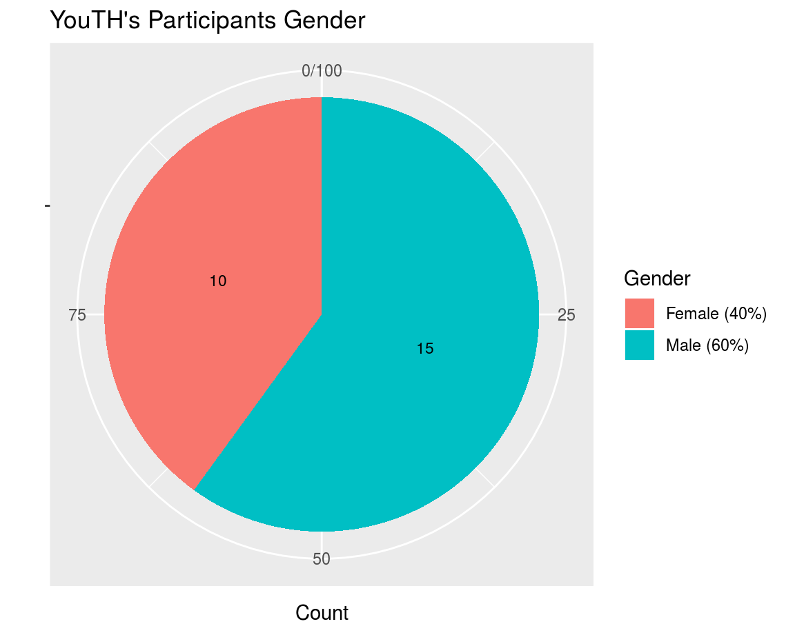

```{r setup, include=FALSE}
knitr::opts_chunk$set(
	echo = FALSE,
	message = FALSE,
	warning = FALSE
)

library(flexdashboard)
```

Analysis 1
=======================================================================


Column {data-width=650}
-----------------------------------------------------------------------

### Chart A

```{r}
library(ggplot2)

ggplot(cars, aes(speed, dist)) + 
  geom_point()
```

Column {data-width=350}
-----------------------------------------------------------------------

### Chart B

```{r}
plot(pressure)
```

### Chart C

```{r}
summary(cars)
```

Analysis 2
=======================================================================


Column {data-width=650}
-----------------------------------------------------------------------

### Chart A



<!-- codes for piechart
ggplot(gender, aes(x = "", y = round(Freq/sum(Freq) * 100), fill = factor(Var1, labels=c("Female (40%)","Male (60%)"))), ) +
  geom_bar(width = 1, stat = "identity") +
  coord_polar("y", start=0) +
    
  labs(x= "", y = "Count", title = "YouTH's Participants Gender") +
   guides(fill = guide_legend(title = "Gender")) +

  geom_text(aes(label = Freq),position = position_stack(vjust = 0.5), size = 3) 
-->


Column {data-width=350}
-----------------------------------------------------------------------

### Chart B


### Chart C

