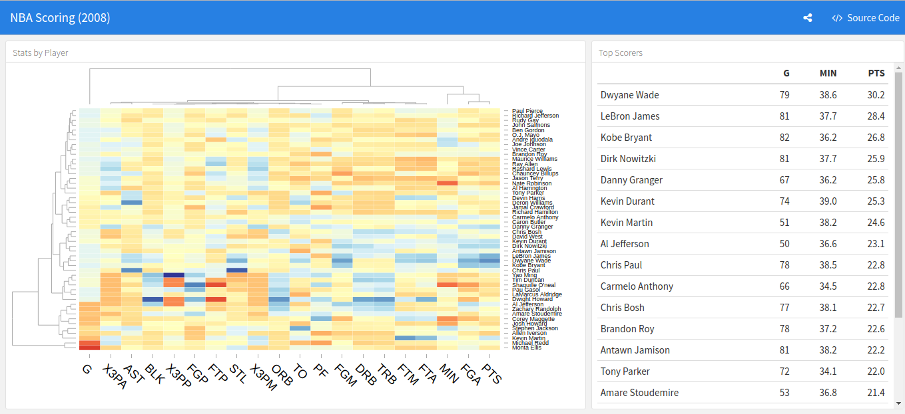

```{r setup, include=FALSE}
knitr::opts_chunk$set(
	echo = FALSE,
	message = FALSE,
	warning = FALSE
)
```


## Data 

Descriptions:
NGO collected health data and more....

Our data is about:
* Health
* With 12 variables, 14 observations


## Problems

* col 1 
* col 2
* col 2

## What we solved?


<!--  -->

## Analysis (insert plots in slide if you don't have dashboards)

```{r}
library(ggplot2)
ggplot(cars, aes(x= speed, y = dist)) +
  geom_point()
  
```

## Demo (Make Dashboard with Flexdashboard)




<!-- 
<script type="text/javascript">
window.addEventListener("mousedown", handleClick, false);
window.addEventListener("contextmenu", function(e) { e.preventDefault(); }, false);

function handleClick(e) {
	e.preventDefault();
	if(e.button === 0) Reveal.next(); 
	if(e.button === 2) Reveal.prev(); 
}
</script>


-->


